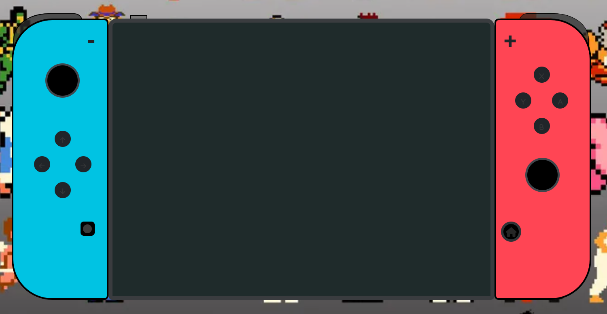
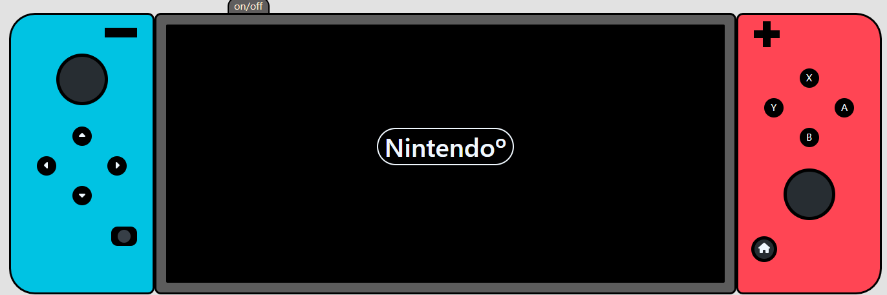
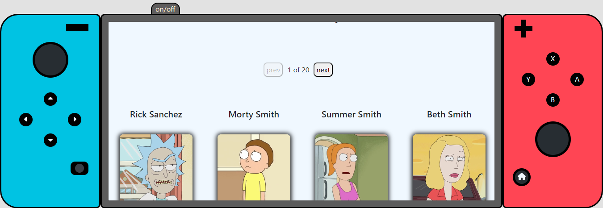
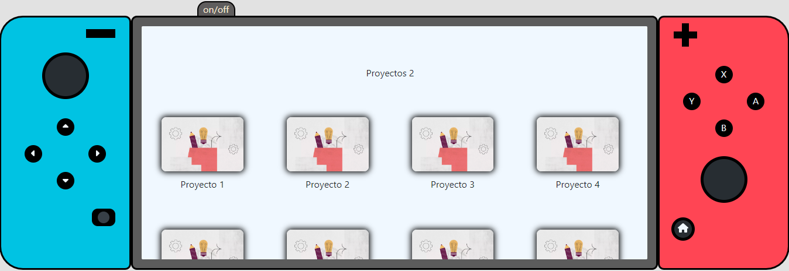

# Bienvenidos a la remasterización del Proyecto Consola Nintendo Switch

## Despliegue

El proyecto está actualmente desplegado en Vercel. Puedes visitar la página web desplegada haciendo clic en el siguiente enlace:

  <em>Nota: El enlace está configurado para abrirse en una nueva ventana. Si el enlace no se abre, intenta hacer clic con el botón derecho y seleccionar "Abrir enlace en una nueva pestaña".</em>

  <a href="https://consola-nintendo-switch.vercel.app" target="_blank">Consola Nintendo Switch</a>

¡Hola! Bienvenidos a la remasterización del Proyecto Consola, creado en Octubre de 2023.

Antes de la remasterización, el proyecto estaba desarrollado con HTML, CSS , JavaScript y Bootstrap. Adjunto foto de cómo lucía antes, con un 60% de responsividad:

  

Ahora, el proyecto ha sido totalmente remasterizado utilizando REACT, SASS y REACT-BOOTSTRAP, logrando una responsividad del 100%. Aquí adjunto fotos de cómo luce ahora:

  
  
  

Funcionalidades:

* Los botones de más (+) y menos (-) se utilizan para ajustar el tamaño de la fuente del texto.

* Las flechas actualmente están programadas para navegar por el menú. Las flechas hacia arriba y hacia abajo se utilizan para desplazarse por las opciones del menú. Para seleccionar una opción, se presiona la tecla A. Para retroceder en el menú, se presiona la tecla B.

Además, he utilizado las siguientes tecnologías en la remasterización del proyecto:

  
  
  

